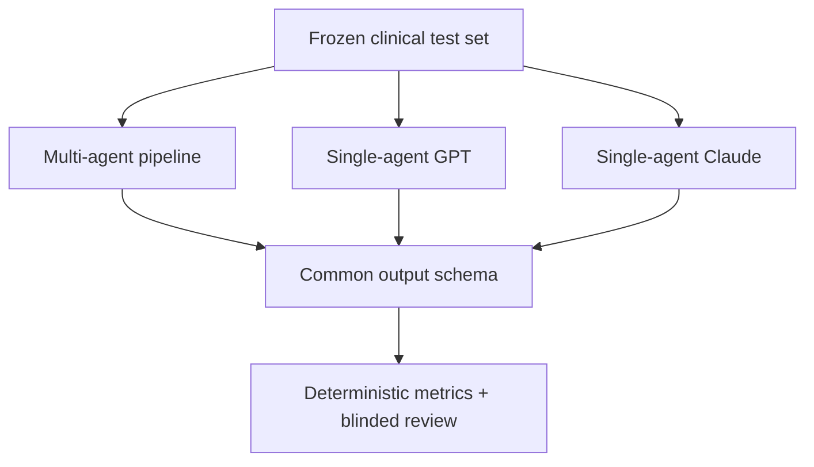
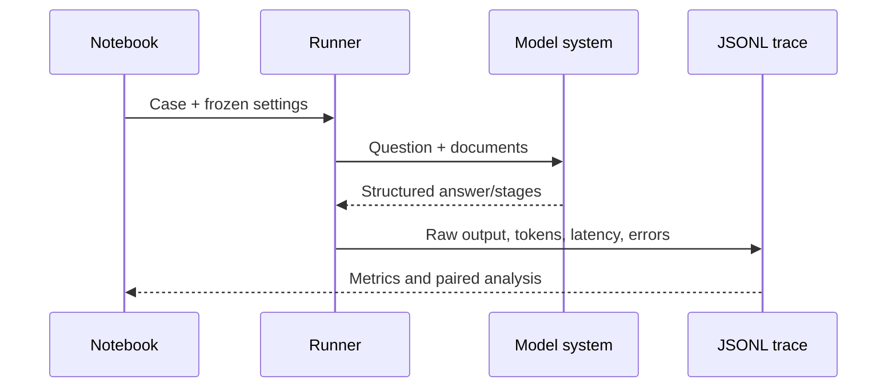

# Multi-Agent Versus Single-Agent Clinical Reasoning: Evaluation Protocol

## Study objective

This experiment tests whether the repository's Supervisor → Specialists → Judge →
Safety pipeline improves answer quality, factual grounding, abstention, and robustness
relative to matched single-agent GPT and Claude baselines. This document is a
preregisterable protocol. Numerical findings must only be added after a frozen test
set is run; the included demonstration cases are software checks, not study evidence.

## Experimental design



All systems receive the same question and documents. The GPT and Claude baselines use
the same system prompt, output schema, temperature, and maximum output length. The
multi-agent system uses the existing repository prompts and orchestration. Keep model
versions fixed, record the run date, and do not tune prompts on the test set.

## Dataset preparation

1. Create a development set for prompt debugging and a separate frozen test set.
2. Give every case a unique `case_id`, question, clinical documents, adjudicated
   reference answer, evidence spans, and an abstention label.
3. Remove identifiers and comply with the data-use agreement. Never send protected
   clinical text to an external API unless explicitly approved.
4. Create perturbation variants for a prespecified subset: irrelevant-note insertion,
   document-order changes, paraphrased questions, and evidence-conflict cases. Give
   variants the same `variant_group`.
5. Use two blinded clinical reviewers and an adjudicator for the reference standard.
   Report agreement before adjudication.

## Systems

| System | Description | Fairness control |
|---|---|---|
| Multi-agent | Existing supervisor, parallel specialists, judge, safety check | Frozen pipeline and models |
| Single GPT | One GPT call | Identical baseline prompt/schema |
| Single Claude | One Claude call | Identical baseline prompt/schema |

Run each stochastic system at least three times if temperature is above zero. For a
primary deterministic analysis, use temperature 0. Randomize execution order where
possible. Save every raw response and stage output in JSONL. Keys must remain in local
environment variables and must never be written to notebooks or traces.

## Outcomes

The recommended primary outcome is blinded clinician-rated answer correctness on an
ordinal scale defined before review. The deterministic `token_f1` is a reproducible
secondary measure, not a substitute for clinical correctness.

| Domain | Metric | Interpretation |
|---|---|---|
| Correctness | Clinician correctness; exact match; token F1 | Agreement with adjudicated answer |
| Grounding | Evidence precision and recall | Quotes supported by source and reference spans |
| Hallucination | Hallucinated evidence rate | One minus evidence precision |
| Uncertainty | Abstention accuracy | Correctly answers or abstains |
| Robustness | Within-group consistency and performance change | Stability across controlled variants |
| Reliability | Error rate and repeated-run variance | Operational and stochastic stability |
| Efficiency | Latency, tokens, estimated cost | Resource tradeoff |

The existing panel agreement score is reported only as an internal process measure.
It cannot establish correctness because mutually confident agents can still agree on
an incorrect answer.

## Statistical analysis

Use paired comparisons because all systems answer the same cases. Report means with
95% case-level bootstrap confidence intervals. Report paired bootstrap differences
for continuous metrics and McNemar's test for binary correctness when sample size is
adequate. Use patient-level resampling if a patient contributes multiple questions.
Control false discovery for multiple secondary outcomes. Present effect sizes and
confidence intervals rather than relying only on p-values.

Perform prespecified subgroup analyses by clinical domain, difficulty, document
length, answerability, and perturbation type. Count errors and abstentions in the
denominator. Do not discard failed API calls; report them as operational failures.

## Trace and audit trail



Each prediction record includes run ID, case ID, system, provider, model, normalized
answer, evidence, confidence, abstention, latency, token counts when available, error
status, and raw or stage-level trace. This supports full reconstruction of tables and
figures while keeping secret keys out of output files.

The implementation permits a separate frozen underlying model for each multi-agent
role: supervisor, specialists, judge, and safety. Each baseline also has an independent
provider and model identifier. The resolved configuration is saved beside the results.

## Reproducible execution

```bash
pip install -e ".[dev,evaluation]"
cp .env.example .env
cp configs/experiment.example.yaml configs/experiment.yaml
python -m evaluation.cli experiment --config configs/experiment.yaml
jupyter lab notebooks/01_multi_vs_single_evaluation.ipynb
```

Before manuscript reporting, replace example data with the frozen adjudicated set,
register exact model identifiers and pricing, complete blinded clinical review, and
run the notebook from a clean environment. The project is research software and must
not be used for patient-care decisions.
